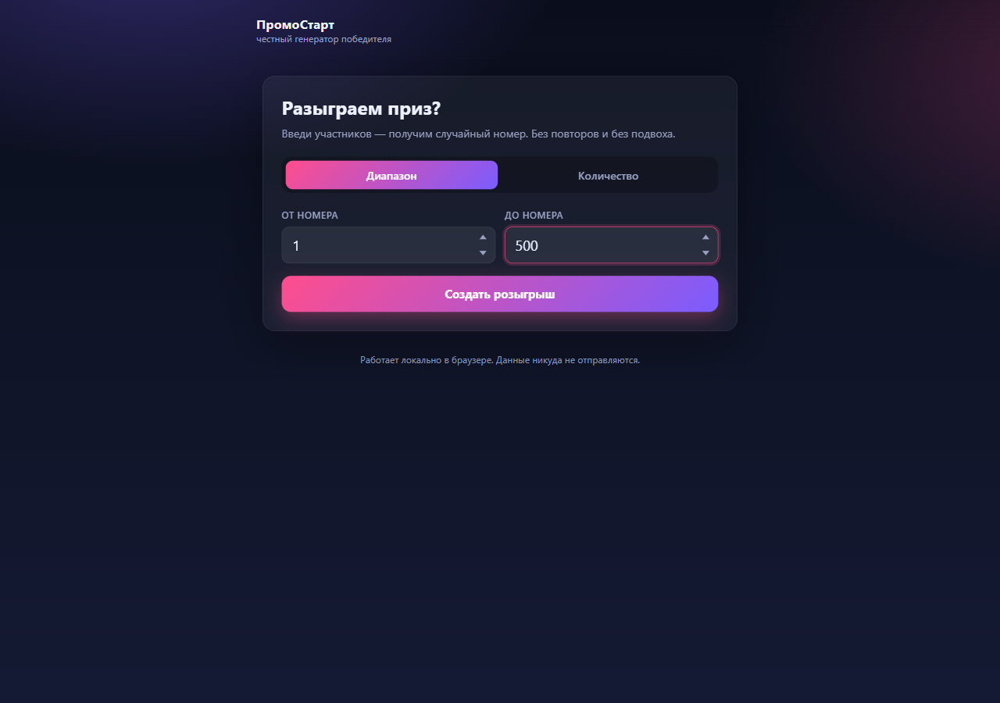
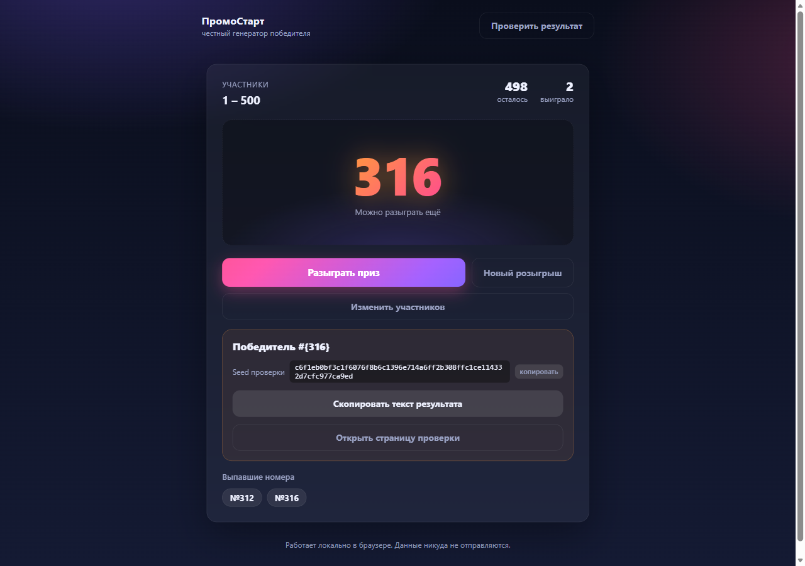
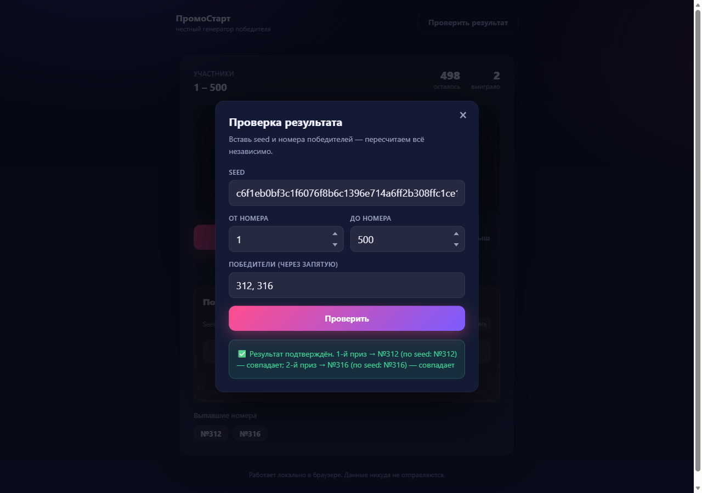

# Честный генератор победителя — ПромоСтарт

Инструмент для проведения честных розыгрышей призов в соцсетях: вводишь диапазон номеров участников (или их количество), а он выбирает случайного победителя. Можно разыгрывать несколько призов подряд — номера не повторяются, пока не закончится пул.

## Демо







## Возможности

- Ввод участников двумя способами: «от N до M» или «количество участников (1..N)»
- Розыгрыш с анимацией прокрутки номеров — удобно для прямых эфиров
- Разыгрывание нескольких призов без повторов, счётчики «осталось / выиграло»
- Выпавшие номера сохраняются в истории текущего запуска
- Кнопка «Скопировать результат» — готовый текст для поста с ссылкой на проверку
- «Новый розыгрыш» (сброс пула, новый seed) и «Изменить участников»

## Почему это честно

- Номер победителя определяется **Web Crypto API** (`crypto.getRandomValues`, 256-битный seed) — не `Math.random()`
- Выбор индекса считается по формуле `SHA-256(seed + номер приза)`
- После каждого розыгрыша инструмент выдаёт **ссылку проверки** вида:

  ```
  https://…/?seed=…&from=1&to=100&winners=42,17
  ```

  Любой участник открывает её и независимо пересчитывает результаты — совпадение подтверждается или опровергается без доверия к организатору.

## Как запустить

Просто открой `index.html` в любом современном браузере (Chrome, Edge, Firefox, Safari). Сервер и установка не нужны — приложение работает полностью локально, данные никуда не отправляются.

Или разверни папку на любом статическом хостинге (GitHub Pages, Netlify, Vercel и т. п.) — дополнительных зависимостей нет.

## Проверка результата

Результат проверяется тремя способами:

1. Ссылка из «Скопировать результат» — откроет страницу и автоматически проверит номера.
2. Кнопка «Открыть страницу проверки» в приложении.
3. Вручную: `SHA-256(seed + ":1")`, `SHA-256(seed + ":2")`, … → индекс в порядке убывания пула.

## Ограничения

- Максимум 1 000 000 участников на розыгрыш
- История хранится только в рамках текущего запуска страницы
- Схема «commit-reveal» (публикация хэша seed **до** розыгрыша) не реализована — для защиты от подмены со стороны недобросовестного организатора используется связка «seed публикуется вместе с результатом и перепроверяем»

## Технологии

- Ванильные HTML + CSS + JavaScript, без сборки и зависимостей
- Web Crypto API для генерации случайных значений
- SHA-256 (Web Crypto, с fallback-реализацией для HTTP-хостов)

## Структура

```
winner-picker/
├── index.html   — интерфейс
├── styles.css   — оформление
└── app.js       — логика генерации, пул без повторов, верификация
```